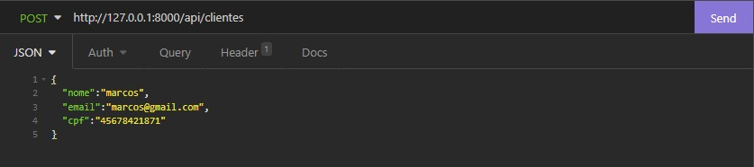
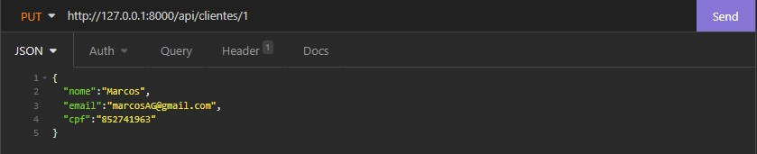
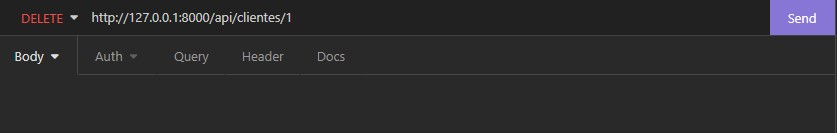

# CRUD - Teste para uma vaga Desenvolvedor PHP Jr. 

<!---Esses são exemplos. Veja https://shields.io para outras pessoas ou para personalizar este conjunto de escudos. Você pode querer incluir dependências, status do projeto e informações de licença aqui--->


>Esse CRUD é de clientes, produtos e pedidos, utilizando linguagem PHP e framework Laravel. Para a modelagem e criação do banco de dados foi usado MySQL (docker). O projeto é voltado para Back-End.


## 💻 Pré-requisitos

Antes de começar, verifique se você atendeu aos seguintes requisitos:
<!---Estes são apenas requisitos de exemplo. Adicionar, duplicar ou remover conforme necessário--->
* Você instalou a versão `PHP 7.4 / Laravel 8.x`.
* Você instalou o composer `https://getcomposer.org`.
* Você instalou o Insomnia `https://insomnia.rest/download` (Para realizar os testes da API).
* Você instalou a versão mais recente do `Docker`. (Foi usado docker para subir o banco de dados MySQL, então as instruções serão pensando nesse funcionamento).


## ☕ Colocando projeto para funcionar
Para rodar o projeto, siga estas etapas:
1. Clonar o repositório.
```
git clone https://github.com/Marcos-Goncalves/test-DotLib.git
```
2. Dentro do repositório, inicie o servidor php.
```
php artisan serve
```
3. Para rodar os containers corretamente, execute o docker-compose já existente dentro do repositório.
```
docker-compose up -d
```
4. Configure o arquivo .env para conectar ao banco de dados (docker-compose vem com PhpMyAdmin para dar uma interface ao banco de dados).
```
DB_CONNECTION=mysql
DB_HOST=127.0.0.1
DB_PORT=3306
DB_DATABASE=Laravel
DB_USERNAME=root
DB_PASSWORD=root
```

5. No insomnia você ira testar funções da aplicação. Com ele aberto, teste as seguintes rotas.

* Cliente ( /api/clientes/{id} ):
1. Para criar


2. Para encontrar


3. Para fazer alterações


4. Para deletar


## 🤝 Colaboradores

Agradecemos às seguintes pessoas que contribuíram para este projeto:

<table>
  <tr>
    <td align="center">
      <a href="#">
        <br>
        <sub>
          <b>Marcos Gonçalves</b>
        </sub>
      </a>
    </td>
    <td align="center">
      <a href="#">
        <br>
        <sub>
          <b>Gabriel Valin</b>
        </sub>
      </a>
    </td>
  </tr>
</table>

## 💬 Contato
Espero que tenham gostado da API, qualquer dúvida ou sugestão, redes sociais abaixo para contato:

<a href="https://www.linkedin.com/in/malxg/"><br>

<a href="https://github.com/Marcos-Goncalves"><br>

<a href="https://twitter.com/ma_alxg"><br>

[⬆ Voltar ao topo](#CRUD)<br>